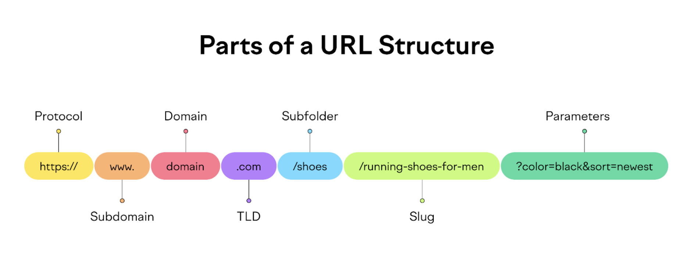
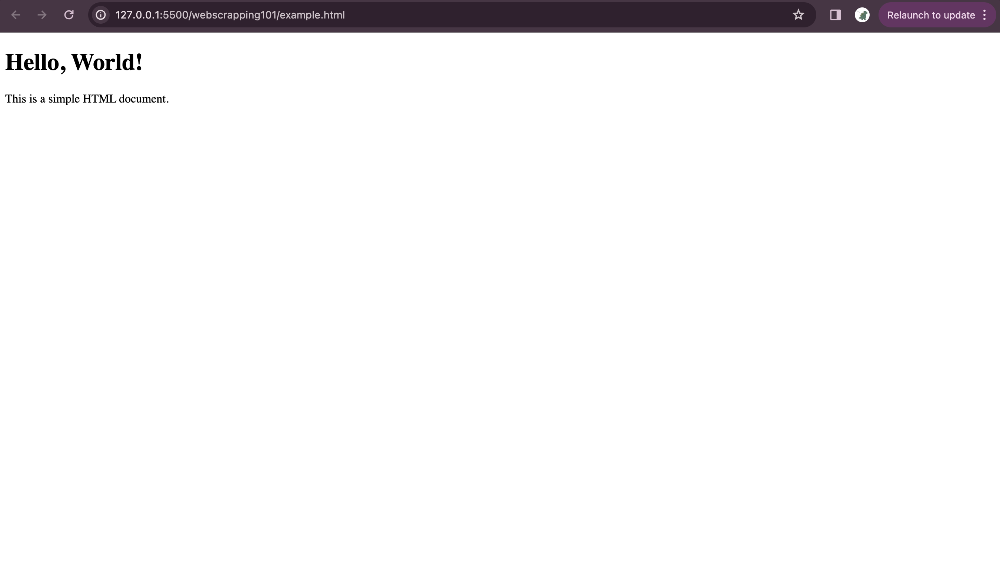
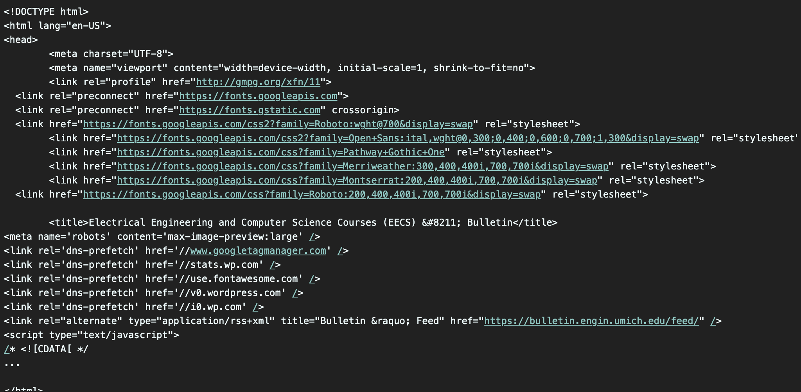
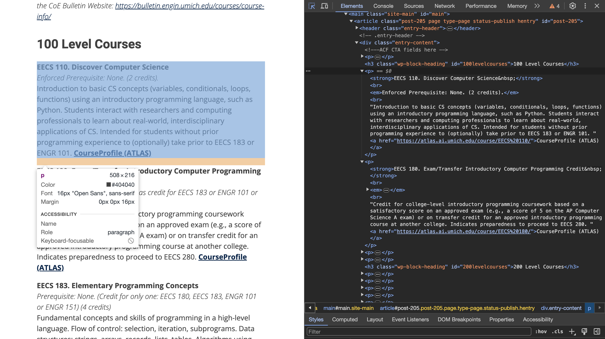
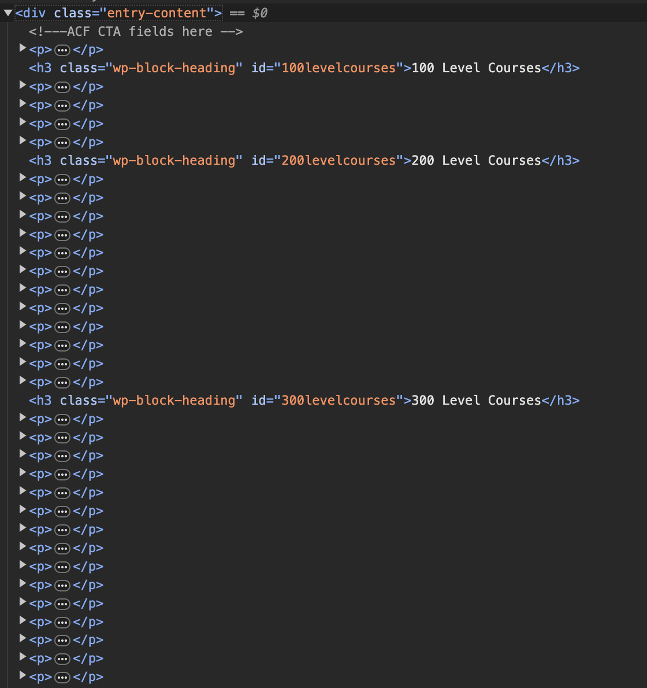

# Web Scraping 101


## Background

From making business decisions to building groundbreacking AI system, massive datasets are used in to provide valuable insights in many fields. However, gathering data is often a challenging task, as it is time consuming and expensive.

A place full of free data is the web, thus utilizing the web for gathering data has become a common practice. We use a powerful technique called Web scraping for such task, automating the manual extraction of data and information from websites online. Web scraping often comes in a two step process, collect the data in raw forms then parse the data for further use.

This guide will we will walkthrough an example of Python's HTTPX for client request and BeautifulSoup to parse HTML of a basic, static, non-blocking webpage.

A [Jupyter Notebook](./scrape.ipynb) file is also provided for running the codes presented in this Markdown article for you to experiment the example we are using here.

1. [Web requests basic](#web-requests)
2. [HTML and CSS](#html-css)
3. [Python](#python-librariesmodule)
4. [Web Scraping - Umich EECS](#web-scraping---umich-eecs)
5. [Data Cleaning and Processing](#clean-and-store-information)


## Web requests

Before diving into web scraping, it is important to understand HTTP fundamentals. The modern websites
are served through the HTTP protocol, which is used for transmitting hypertext requests and information
between servers and browsers. We, as clients, send requests to the webite (servers) for resources. The server
processes our request and reply with a response of cooresponding web data (or error message in the event of a failure )


In the process of web scraping, we primarily deal with HTTP requests and responses. These are the fundamental components of data communication on the web. Let's take a look into their structure and relevance to web scraping.

### HTTP Requests

An HTTP request is composed of three main parts:

1. Method: one of several types that define the kind of action to be performed. eg.
    - GET: requests a resource.
    - POST: requests a resource by sending additional data.
    - HEAD: requests meta information about a resource, such as its last update time.
2. Headers: provide metadata about our request.
3. Location: specifies the resource we aim to retrieve. They are defined by URL (Uniform Resource Locator)
4. Body Message: The data to be delivered during the requests that sends data. (POST, PUT, PATCH). Often in the form of JSON. 

More information on [URL parameter](https://www.semrush.com/blog/url-parameters/#) and [file paths](https://www.codecademy.com/resources/docs/html/file-paths)




\*In web scraping, GET requests are predominantly used as we aim to retrieve documents. POST requests are also common when interacting with web page elements like forms, search bars, or pagination. HEAD requests can be used for optimization, allowing scrapers to request meta information and then decide whether downloading the entire page is worthwhile.

Some other methods that are used extensively in web communications are PATCH, PUT, and DELETE,
Though these methods are less common in web scraping

PATCH: updates an existing resource.

PUT: either creates a new resource or updates an existing one.

DELETE: deletes a resource.

### HTTP Responses

The server responds with an HTTP response, which includes:

1. Status code: A three-digit number indicate the status of a web request. eg.
    - 200 OK: Request Successful, expected contents returned
    - 400 Bad Request: Server could not understand the request (invalid syntax ...)
    - 401 Unauthorized: Understook the request, but need user authentication
    - 404 Not Found: The requested resource/path is not found.
2. Headers: provide metadata about the response.
3. Content: the actual data of the page, such as HTML or JSON. It is this data that we will be parsing and collecting as we scrape the website.


In a nutshell, we are sending web requests to web pages, retriving their contents in the form of HTML, CSS, and parsing those contents into usable data. So now we understand web requests, lets take a quick look in HTML and CSS

## HTML & CSS

HTML (HyperText Markup Language) and CSS (Cascading Style Sheets) are two of the core technologies used for building web pages. HTML provides the structure of the page, while CSS styles and lays out the page.

HTML:

HTML is a markup language that uses tags to structure content on the web. Each HTML tag describes a different type of content - for example, `<p>` for paragraphs, `<h1>` for main headings, `` for images, and so on. HTML tags can have attributes, which provide additional information about the element. For example, the `src` attribute in an `` tag specifies the source URL of the image.

Here's a simple HTML document:

```html
<!DOCTYPE html>
<html>
	<head>
		<title>My First HTML Page</title>
	</head>
	<body>
		<h1>Hello, World!</h1>
		<p>This is a simple HTML document.</p>
	</body>
</html>
```



CSS:

CSS is a stylesheet language used to describe the look and formatting of a document written in HTML. CSS handles the layout, colors, fonts, and all other visual aspects of the page. CSS can be included in HTML in three ways: inline (by using the `style` attribute inside HTML elements), internal (by placing the CSS rules within `<style>` tags in the `head` section), or external (by linking to an external .css file).

Here's an example of CSS:

```css
body {
	background-color: lightblue;
}

h1 {
	color: white;
	text-align: center;
}

p {
	font-family: verdana;
	font-size: 20px;
}
```

This CSS will set the background color of the page to light blue, center-align the text in `<h1>` elements and color it white, and set the font of `<p>` elements to Verdana and the font size to 20 pixels.


HTML in Web Scraping:

When you're scraping a website, what you're doing is programmatically analyzing the HTML of the web page to find the information you need. Each piece of information on a web page is typically enclosed in specific HTML tags. For example, main headings are usually in `<h1>` tags, paragraphs in `<p>` tags, links in `<a>` tags, and so on. By identifying the correct tags and their structure, a web scraper can extract the desired information.

CSS in Web Scraping:

CSS comes into play in web scraping when dealing with CSS selectors. CSS selectors are patterns used to select the elements you want to style in a webpage. However, in the context of web scraping, they can be used to navigate HTML trees and extract data from them. Many web scraping tools allow you to use CSS selectors to specify the data you want to scrape. For example, if you want to scrape all the links within a paragraph, you might use a CSS selector like `p a`.

In summary, understanding HTML and CSS is fundamental to web scraping because they allow you to identify the structure and elements of a web page from which you want to extract data.


## Python Libraries/Module

Now that we have covered the basic background needed for web scraping, let's actually see how we can implement them using Python to automate the data collecting process. Specifically, we will be using these libraries

**httpx**: an HTTP client library frequently used in web scraping. While the requests library is another popular alternative, we'll use httpx in this tutorial as it's more tailored for web scraping tasks. It supports both HTTP/1.1 and HTTP/2, and allows for request timeouts, retries, and other features beneficial for web scraping.

**beautifulsoup**: used for parsing HTML and XML documents. It creates parse trees from page source code that can be used to extract data easily. BeautifulSoup provides a few simple methods and Pythonic idioms for navigating, searching, and modifying a parse tree.

**re**: Python's regular expression module.

<a name="scraping"></a>
## Web Scraping - Umich EECS

Now lets use Python to do some simple web scraping on Umich eecs course page https://bulletin.engin.umich.edu/courses/eecs/

### Note that all the code are in [scrape.ipynb](./scrape.ipynb) for you to try out on your own


For the list of EECS courses, we want to put each courses' course code, name, credit, and ATLAS link into a csv file. We will also include all the prereq descriptions in a final column as note to that course. We will leave the course description out, as they are in long paragraphs and does not matter in our case of learning to web scrape.

We first import the httpx library, then we specify the request headers, send a get request to the EECS webpage. The returned object is stored in response, we then fetch the text attribute of the returned object and print it out.

The Accept header specifies what information we are expected to receive. In our case, we have configured it to mimic the usual browser default of Chrome, which is a common standard among web scraping.

The User-Agent header holds information about the client's identity. It tells the server what type of client is making the request, a laptop web browser? a cellphone?... It is in the format of Browser Name, Operating System, Some version numbers. The servers can check the header and make a decision on whether or not to serve the content. We want to conceal ourselves with our scraping activity, so we want the header to hold information that present ourselves as we are a browser making a normal browser request.

A documentation of all user-agent strings for chrome on different platforms: https://www.whatismybrowser.com/guides/the-latest-user-agent/chrome

```python
import httpx

url = "https://bulletin.engin.umich.edu/courses/eecs/"
headers = {
    'Accept': 'text/html,application/xhtml+xml,application/xml;q=0.9,image/webp,image/apng,*/*;q=0.8',
    'User-Agent': 'Mozilla/5.0 (Macintosh; Intel Mac OS X 10_15_5) AppleWebKit/537.36 (KHTML, like Gecko) Chrome/83.0.4103.97 Safari/537.36',
}
response = httpx.get(url,headers=headers)
print(response.text)
```

Running the code above, we get the following output.



The output is the html content of the webpage

We can analyze this returned HTML directly, or even better, use developer tools provided by browser to analyze the website's components, layout, and structures.

Open up "Inspect Element" in Chrome. (This can be done by clicking on "View" -> "Developer" -> "Inspect Element")



Through some examination, we can see that each of the course information are enclosed in a "\<p>" tag under "\<div class=entry-content>". The course code and name are in the "\<strong>" tag. The course credit and prerequisite are in "\<em>", and finally, the atlas link is embedded in a "\<a href>" hyperlink tag.

Here is a more zoomed in view.


We want to parse all of the informations enclosed in tags listed above for every course under the p tag. We will do this using Beautifulsoup.

and here is a zoomed out view of all the course blocks.


First take a look of selecting all the p tags under "\<div class="entry-content">" and printing their cotent out in full.

```python
from bs4 import BeautifulSoup

parser = BeautifulSoup(response, 'html.parser')

div = parser.find('div', class_= "entry-content")

p_tags = div.find_all('p')[1:] # through inspection the first tag is irrelevant.

for p in p_tags:
    print(p.get_text())
```


A raw look

```python
for p in p_tags:
    print(p)
```


As described in our guide, we only need the informations under the "strong", "em", and "a" tag. For "a" tag, we need its "href" attribute for a web url (instead of the literal words "CourseProfile (ATLAS)" )

```python
course = []
prereq = []
link = []

for p in p_tags:
    strong, em, a = p.find('strong'), p.find('em'),  p.find('a')
    if strong is not None: course.append(strong.getText())
    if em is not None: prereq.append(em.getText())
    if a is not None: link.append(a['href']) # Get the href attribute, not literal text

print(course)
print(prereq)
print(link)

```


Some of the courses have the character \xa0, a variant of a standard space chraracter that prevents an automatic link break at its position. We need to strip it.

```python
course = [c .replace('\xa0', '') for c in course]
print(course)
```


## Clean and store information.

Another big part of web scraping other than the act of scraping itself is cleaning, processing, and storing the collected informations. Now, lets take a look of how to store the data into a csv file in a schema which we discussed previously.

See regex guide [here](https://developer.mozilla.org/en-US/docs/Web/JavaScript/Guide/Regular_expressions/Cheatsheet)

Use regex to process the data.

1. Seperate course code and course name.
2. Extract credit information
3. Put course code, course name, credit information, link, and prereq to seperate attributes

| CourseCode | CourseName | Credit | Link | Note |
| ---------- | ---------- | ------ | ---- | ---- |

```python
import re
data = []
for c, p, l in zip(course, prereq, link):
    data_entry = {}
    course_split = c.split(".", 1) # Split at first occurance of a period
    if len(course_split) != 2: continue # Skip instances where there is bad course format.
    data_entry["CourseCode"] = course_split[0]
    data_entry["CourseName"]= course_split[1].lstrip(" ") # Remove leading space.

    credit = re.findall(r'\((\d+)\s+credits\)', p)
    """
    the regular expression \((\d+)\s+credits\) matches any sequence of digits (\d+)
    that are directly after a parenthesis and followed by one or more spaces (\s+)
    and the word "credits". The parentheses around \d+ create a group that
    findall() returns as a list.
    """
    data_entry["Credit"] = credit
    data_entry["Link"] = l
    data_entry["Note"] = p
    data.append(data_entry)

for entry in data:
    print(entry)
```


Now, lets put our data into a CSV file.

```python
import pandas as pd
df = pd.DataFrame(data)
df.to_csv('eecs_course.csv', index=False)
```

Not we have a great CSV file ready to go


## Attribution

Generative AI, Scrapfly.io
